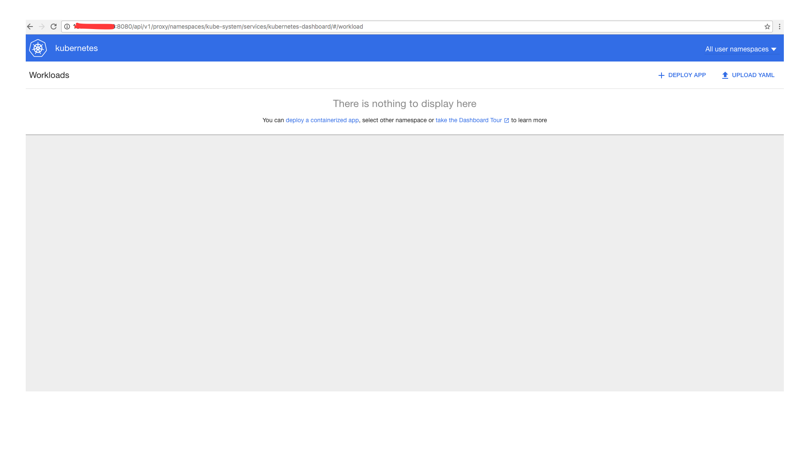
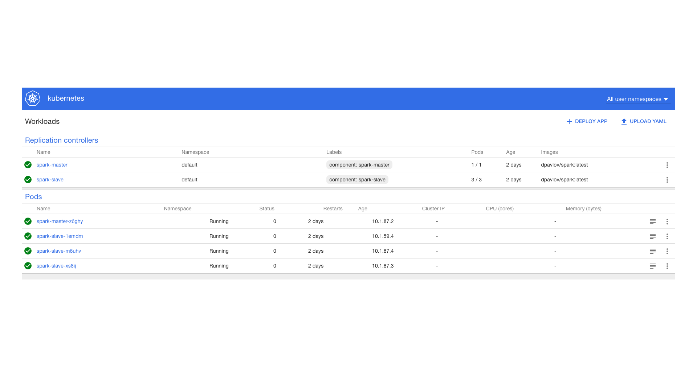
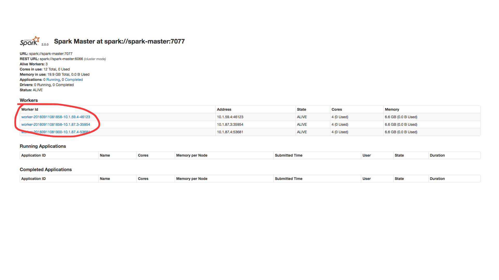

#This is a kuberenetes docker image that runs spark and slaves on kube, each instance is a pod.  
##Installation instractions:  
Download kube-deploy:   
1. git clone https://github.com/kubernetes/kube-deploy.git  
2. Install docker on each instance of you linux server, make sure it is the same version of docker and it is the same version kubernetes was tested on to avoid strange issues.  
3. Download spark4kube: git clone https://github.com/2dmitrypavlov/spark4kube.git  
4. cd kube-deploy  
5. Run ./master.sh or follow kube-deploy instractions to start kubernetes, after a minute make sure it is running, by going to dashboard http://<server ip - host >:8080/api/v1/proxy/namespaces/kube-system/services/kubernetes-dashboard/#/workload:  
6. you should see something like that:  
  
7. or run from command line:  
```sh
kubectl get svc/pods:   
➜  ~ kubectl get svc    
NAME           CLUSTER-IP   EXTERNAL-IP   PORT(S)    AGE    
kubernetes     10.0.0.1     <none>        443/TCP    2d   
```

#Running spark4kube:
cd spark4kube  
Run: sh start-all.sh it should start all the scripts, or as alternative run line by line:  
##Create master instance 
```sh
➜  spark4kube git:(master) kubectl create -f spark-master.yaml   
replicationcontroller "spark-master" created   
➜  spark4kube git:(master) kubectl get pods   
NAME                 READY     STATUS    RESTARTS   AGE  
spark-master-8qvw8   1/1       Running   0          10s  
```
##Create two services so workers can find the master and you can access the gui  
```sh
➜  spark4kube git:(master) kubectl create -f spark-master-service.yaml  
service "spark-master" created  
Make sure service is running:  
➜  spark4kube git:(master) kubectl get svc  
NAME           CLUSTER-IP   EXTERNAL-IP   PORT(S)    AGE  
kubernetes     10.0.0.1     <none>        443/TCP    2d  
spark-master   10.0.0.207   <none>        7077/TCP   7s  
➜  spark4kube git:(master) 

➜  spark4kube git:(master) kubectl create -f spark-webui-service.yaml 
service "spark-webui" created
```
Make sure service is running:
```sh
➜  spark4kube git:(master) kubectl get svc  
NAME           CLUSTER-IP   EXTERNAL-IP   PORT(S)    AGE  
kubernetes     10.0.0.1     <none>        443/TCP    2d  
spark-master   10.0.0.207   <none>        7077/TCP   1m  
spark-webui    10.0.0.77    <none>        8080/TCP   23s  
```
Go to http://server-ip:8080/api/v1/proxy/namespaces/default/services/spark-webui/ and make sure spark Master is ready:    
  
##Run slaves, to change number os slaves open spark-slaves.yaml script and change number of  "replicas: 3" to any number you need. Each worker runs on separate pod.  
```sh
➜  spark4kube git:(master) kubectl create -f spark-slaves.yaml  
replicationcontroller "spark-slave" created   
```
  
You can go back to spark master and see that workers are attached.
  

#Zeppelin - you can access spark cluster with zeppelin notebooks:  
http://server-ip:8080/api/v1/proxy/namespaces/default/services/spark-zeppelin/  
To save zeppelin notebooks to zeppelinhub.com you will need to export ZEPPELINHUB_API_TOKEN="you token" and restart zeppelin.
Run private file set_zeppelin.sh it will do the job 15 minutes after you start zeppelin manually, or just run star-all.sh


#Version update instractions:  
To change spark version just go to docker folder and opent Dockerfile -> change   
RUN wget http://d3kbcqa49mib13.cloudfront.net/spark-2.0.0-bin-hadoop2.7.tgz to a new binary pre compiled spark version, and replace all apperance of "spark-2.0.0-bin-hadoop2.7" with new version file new name.  
From command line inside ~/spark4kube/docker run: 
```sh
docker build . -t dpavlov/spark:latest  
docker commit -m"updated spark to version 2.x"  
docker push  
```


